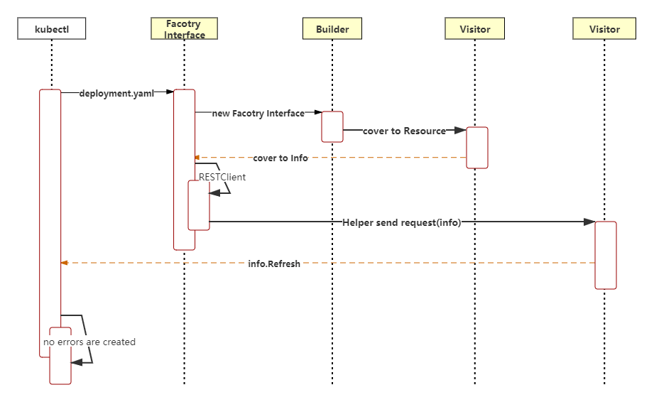

## 一、命令行参数详解

1、基础命令（初级）

| 命令           | 说明                                                         |
| -------------- | ------------------------------------------------------------ |
| kubectl create | 通过JSON/YAML文件或标准输入创建一个资源对虾干，支持很多子命令，例如namespace、pod、service等 |
| kubectl expose | 将JSON/YAML文件中定义的资源对象的端口暴露给新的service对象   |
| kubectl run    | 创建并运行一个或多个容器镜像                                 |
| kubectl set    | 配置资源对象，设置特定功能                                   |

2、基础命令（中级）

| 命令            | 说明                                                        |
| --------------- | ----------------------------------------------------------- |
| kubectl explain | 查看资源对象的详细信息                                      |
| kubectl get     | 获取一个或多个资源对象的信息                                |
| kubectl edit    | 使用默认编辑器编辑服务器上定义的资源对象                    |
| kubectl delete  | 通过JSON/YAML文件、标准输入、资源名称或标签选择器来删除资源 |

3、部署命令

| 命令                   | 说明                                                       |
| ---------------------- | ---------------------------------------------------------- |
| kubectl rollback       | 管理资源对象的部署                                         |
| kubectl rolling-update | 使用RC进行滚动更新                                         |
| kubectl scale          | 扩容或缩容Deployment、ReplicaSet、Replication Controller等 |
| kubectl autoscale      | 自动设置在kubernetes系统中运行的Pod数量（水平自动伸缩）    |

4、集群管理命令

| 命令                 | 说明                                |
| -------------------- | ----------------------------------- |
| kubectl certificate  | 修改证书资源对象                    |
| kubectl cluster-info | 查看集群信息                        |
| kubectl top          | 显示资源（CPU、内存、存储）使用情况 |
| kubectl cordon       | 将指定节点标记为不可调度            |
| kubectl uncordon     | 将指定节点标记为可调度              |
| kubectl drain        | 安全地驱逐指定节点上的所有Pod       |
| kubectl taint        | 将一个或多个节点设置为污点          |

5、故障排查和调试命令	

| 命令                 | 说明                                  |
| -------------------- | ------------------------------------- |
| kubectl describe     | 显示一个或多个资源对象的详细信息      |
| kubectl logs         | 输出Pod资源对象中一个容器的日志       |
| kubectl attach       | 连接到一个正在运行的容器              |
| kubectl exec         | 在指定容器内执行命令                  |
| kubectl port-forward | 将本机指定端口映射到Pod资源对象的端口 |
| kubectl proxy        | 将本机指定端口映射到kube-apiserver    |
| kubectl cp           | 用于Pod与主机交换文件                 |
| kubectl auth         | 检查验证                              |

6、高级命令

| 命令              | 说明                                                         |
| ----------------- | ------------------------------------------------------------ |
| kubectl diff      | 对比本地JSON/YAML文件与kube-apiserver中运行的配置文件是否有差异 |
| kubectl apply     | 通过JSON/YAML文件、标准输入对资源对象进行配置更新            |
| kubectl patch     | 通过patch方式修改资源对象字段                                |
| kubectl replace   | 通过JSON/YAML文件或标准输入来替换资源对象                    |
| kubectl wait      | 在一个或多个资源上等待条件达成                               |
| kubectl convert   | 转换JSON/YAML文件为不同的资源版本                            |
| kubectl kustomize | 定制kubernetes配置                                           |

7、设置命令

| 命令               | 说明                                           |
| ------------------ | ---------------------------------------------- |
| kubectl label      | 增、删、改资源的标签                           |
| kubectl annotate   | 更新一个或多个资源对象的注释（Annotation）信息 |
| kubectl completion | 命令行自动补全                                 |

8、其他命令	

| 命令                  | 说明                                                         |
| --------------------- | ------------------------------------------------------------ |
| kubectl config        | 管理kubeconfig配置文件                                       |
| kubectl plugin        | 运行命令行插件功能                                           |
| kubectl version       | 查看客户端和服务端的系统版本信息                             |
| kubectl api-versions  | 列出当前kubernetes系统支持的资源组和资源版本，其表现形式为<group>/<version> |
| kubectl api-resources | 列出当前kubernetes系统支持的resource资源列表                 |
| kubectl options       | 查看支持的参数列表                                           |

## 二、Cobra命令行参数解析

```go
package main

import (
	"fmt"
	"github.com/spf13/cobra"
)

func main() {
	var Version bool
	var rootCmd = &cobra.Command{
		Use: "root [sub]",
		Short: "root command",
		Run: func(cmd *cobra.Command, args []string) {
			fmt.Printf("Inside rootCmd Run with args: %v\n",args)
			if Version {
				fmt.Printf("Version: 1.0\n")
			}
		},
	}
	flags := rootCmd.Flags()
	flags.BoolVarP(&Version,"version","v",false,"Print version information and quit")
	rootCmd.Execute()
}
```

Cobra基本应用步骤分为以下3步：

1、创建rootCmd主命令，并定义Run执行函数。也可以通过`rootCmd.AddCommand`方法添加子命令

2、为命令添加命令行参数（Flag）

3、执行rootCmd命令调用的函数，`rootCmd.Execute`会在内部回调Run执行函数。

### 创建Command

[staging/src/k8s.io/kubectl/pkg/cmd/cmd.go]

```go
func NewKubectlCommand(in io.Reader, out, err io.Writer) *cobra.Command {
	...
	groups := templates.CommandGroups{
		{
			Message: "Basic Commands (Beginner):",
			Commands: []*cobra.Command{
				create.NewCmdCreate(f, ioStreams),
				expose.NewCmdExposeService(f, ioStreams),
				run.NewCmdRun(f, ioStreams),
				set.NewCmdSet(f, ioStreams),
			},
		},
		...
	}
	groups.Add(cmds)
	...
	cmds.AddCommand(alpha)
	cmds.AddCommand(cmdconfig.NewCmdConfig(f, clientcmd.NewDefaultPathOptions(), ioStreams))
	cmds.AddCommand(plugin.NewCmdPlugin(f, ioStreams))
	cmds.AddCommand(version.NewCmdVersion(f, ioStreams))
	cmds.AddCommand(apiresources.NewCmdAPIVersions(f, ioStreams))
	cmds.AddCommand(apiresources.NewCmdAPIResources(f, ioStreams))
	cmds.AddCommand(options.NewCmdOptions(ioStreams.Out))

	return cmds
}
```

`NewKubectlCommand`函数实例化了`cobra.Command`对象，`templates.CommandGroups`定义了kubectl的8种命令类别，分别是基础命令（初级）、基础命令（中级）、部署命令、集群管理命令、故障排查和调试命令、高级命令、设置命令，最后通过`cmds.AddCommand`函数添加了第8种命令类别---其他命令。

以`get`命令为例:[staging/src/k8s.io/kubectl/pkg/cmd/get/get.go]

```go
// NewCmdGet creates a command object for the generic "get" action, which
// retrieves one or more resources from a server.
func NewCmdGet(parent string, f cmdutil.Factory, streams genericclioptions.IOStreams) *cobra.Command {
	o := NewGetOptions(parent, streams)

	cmd := &cobra.Command{
		Use:                   "get [(-o|--output=)json|yaml|wide|custom-columns=...|custom-columns-file=...|go-template=...|go-template-file=...|jsonpath=...|jsonpath-file=...] (TYPE[.VERSION][.GROUP] [NAME | -l label] | TYPE[.VERSION][.GROUP]/NAME ...) [flags]",
		DisableFlagsInUseLine: true,
		Short:                 i18n.T("Display one or many resources"),
		Long:                  getLong + "\n\n" + cmdutil.SuggestAPIResources(parent),
		Example:               getExample,
		Run: func(cmd *cobra.Command, args []string) {
			cmdutil.CheckErr(o.Complete(f, cmd, args))
			cmdutil.CheckErr(o.Validate(cmd))
			cmdutil.CheckErr(o.Run(f, cmd, args))
		},
		SuggestFor: []string{"list", "ps"},
	}

	o.PrintFlags.AddFlags(cmd)
	...
	return cmd
}
```

cobra的run函数家族成员有很多，执行顺序是PersistentPreRun->PreRun->Run->PostRun->PeristentPostRun。

### 为get命令添加命令行参数

```go
// NewCmdGet creates a command object for the generic "get" action, which
// retrieves one or more resources from a server.
func NewCmdGet(parent string, f cmdutil.Factory, streams genericclioptions.IOStreams) *cobra.Command {
	...
	cmd.Flags().BoolVarP(&o.AllNamespaces, "all-namespaces", "A", o.AllNamespaces, "If present, list the requested object(s) across all namespaces. Namespace in current context is ignored even if specified with --namespace.")
	...
	return cmd
}
```

### 执行命令

[cmd/kubectl/kubectl.go]

```go
func main() {
	rand.Seed(time.Now().UnixNano())

	command := cmd.NewDefaultKubectlCommand()
    ...
	if err := command.Execute(); err != nil {
		os.Exit(1)
	}
}
```

## 三、创建资源对象的过程

Deployment是一种常见的资源对象。在kubernetes系统中创建资源对象有很多方法。本节将对用`kubectl create`命令创建Deployment资源对象的过程进行分析。



原理：客户端与服务端进行一次HTTP请求的交互。

流程：实例化Factory接口、通过Builder和Visitor将资源对象描述文件(deployment.yaml)文本格式转换成资源对象。将资源对象以HTTP请求的方式发送给kube-apiserver，并得到响应结果。最终根据Visitor匿名函数集的errors判断是否成功创建了资源对象。

- 实例化Factory接口[staging/src/k8s.io/kubectl/pkg/cmd/util/factory.go]

```go
type Factory interface {
	genericclioptions.RESTClientGetter

	// 动态客户端
	DynamicClient() (dynamic.Interface, error)

	// clientset客户端
	KubernetesClientSet() (*kubernetes.Clientset, error)

	// RESTClient客户端
	RESTClient() (*restclient.RESTClient, error)

	// 实例化Builder，Builder用于将命令行获取的参数转换成资源对象
	NewBuilder() *resource.Builder

	// Returns a RESTClient for working with the specified RESTMapping or an error. This is intended
	// for working with arbitrary resources and is not guaranteed to point to a Kubernetes APIServer.
	ClientForMapping(mapping *meta.RESTMapping) (resource.RESTClient, error)
	// Returns a RESTClient for working with Unstructured objects.
	UnstructuredClientForMapping(mapping *meta.RESTMapping) (resource.RESTClient, error)

	// 验证资源对象
	Validator(validate bool) (validation.Schema, error)
	// OpenAPISchema returns the schema openapi schema definition
	OpenAPISchema() (openapi.Resources, error)
}
```

- Builder构建资源对象[staging/src/k8s.io/kubectl/pkg/cmd/create/create.go]

```go
func (o *CreateOptions) RunCreate(f cmdutil.Factory, cmd *cobra.Command) error {
	...
	r := f.NewBuilder().
		Unstructured().
		Schema(schema).
		ContinueOnError().
		NamespaceParam(cmdNamespace).DefaultNamespace().
		FilenameParam(enforceNamespace, &o.FilenameOptions).
		LabelSelectorParam(o.Selector).
		Flatten().
		Do()
	err = r.Err()
	if err != nil {
		return err
	}
    ...
}
```

- Visitor多层匿名函数嵌套

在Builder Do函数中，Result对象中的结果由Visitor执行并产生。

