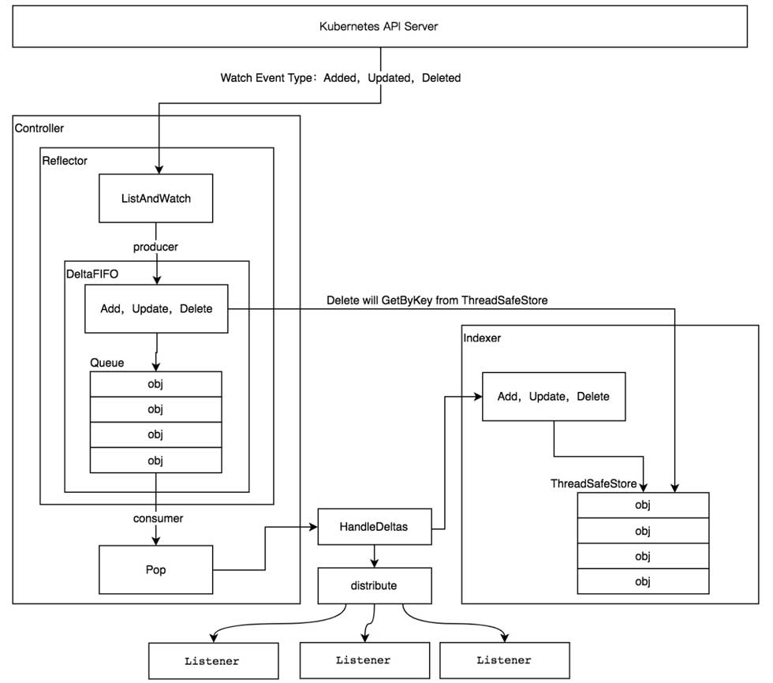

## 源码目录

| 源码目录   | 说明                                                         |
| ---------- | ------------------------------------------------------------ |
| discovery  | 提供DiscoveryClient发现客户端                                |
| dynamic    | 提供DynamicClient动态客户端                                  |
| informers  | 每种Kubernetes资源的Informer实现                             |
| kubernetes | 提供ClientSet客户端                                          |
| listers    | 为每一个kubernetes资源提供Lister功能，该功能对Get和List请求提供只读的缓存数据 |
| plugin     | 提供OpenStack、GCP和Azure等云服务商授权插件                  |
| rest       | 提供RESTClient客户端，对Kubernetes API Server执行RESTful操作 |
| scale      | 提供ScaleClient客户端，用于扩容或缩容Deployment、ReplicaSet、RC等资源对象 |
| tools      | 提供常用工具，例如SharedInformer、Reflector、DealtFIFO及Indexers。提供Client查询和缓存机制，以减少向kube-apiserver发起的请求数等 |
| transport  | 提供安全的TCP连接，支持Http Stream，某些操作需要在客户端和容器之间的传输二进制流，例如exec、attach等操作。该功能由内部的spdy包提供支持。 |
| util       | 提供常用方法，例如WorkQueue工作队列、Certificate证书管理等。 |

RESTClient是最基础的客户端。RESTClient对HTTP Request进行了封装，实现了RESTful风格的API。ClientSet、DynamicClient及DiscoveryClient客户端都是基于RESTClient实现的。

- ClientSet在RESTClient的基础上封装了对Resource和Version的管理方法。每个Resource可以理解为一个客户端，而ClientSet则是多个客户端的集合，每个Resource和Version都以函数的形式暴露给开发者。而ClientSet只能够处理kubernetes内置资源，是由client-gen代码生成器自动生成的。
- DynamicClient与ClientSet最大的不同之处是，ClientSet仅能访问kubernetes内置资源，不能直接访问CRD自定义资源。DynamicClient能够处理kubernetes中的所有资源对象。
- DiscoveryClient发现客户端，用于发现kube-apiserver所支持的资源组、资源版本，资源信息（Group、Version、Resources）

### 1、kubeconfig配置管理

kubeconfig用于管理访问kube-apiserver的配置信息，同时也支持访问多kube-apiserver的配置管理，可以在不同的环境下管理不同的kube-apiserver集群配置，不同的业务线也可以拥有不同的集群。kubernetes的其他组件都使用kubeconfig配置信息来连接kube-apiserver组件，例如当kubectl访问kube-apiserver时，会默认加载kubeconfig配置信息。

kubeconfig中存储了集群、用户、命名空间和身份验证等信息，在默认情况下，kubeconfig会存放在`$HOME/.kube/config`路径下。kubeconfig配置信息如下：

```bash
$ cat $HOME/.kube/config
apiVesion: v1
kind: Config
preferences: {}

clusters:
- cluster:
  name: dev-cluster
users:
- name: dev-user
contexts:
- context
  name: dev-context
```

kubeconfig配置信息通常包含3个部分，如下：

- clusters：定义kubernetes集群信息，例如kube-apiserver的服务地址及集群的证书信息等。
- users：定义kubernetes集群用户身份验证的客户端凭据，例如client-certificate,client-key,token及username/password等。
- contexts：定义kubernetes集群用户信息和命名空间等，用于将请求发送到指定的集群。

client-go会读取kubeconfig配置信息并生成config对象。

```go
package main
import "k8s.io/client-go/tools/clientcmd"

func main() {
    config, err := clientcmd.BuildConfigFromFlags("", *kubeconfig)
	if err != nil {
		panic(err)
	}
    ...
}
```

`clientcmd.BuildConfigFromFlags`函数会读取kubeconfig配置信息并实例化rest.Config对象。其中kubeconfig最核心的功能是管理多个访问kube-apiserver集群的配置信息，将多个配置信息合并(merge)成一份，在合并的过程中会解决多个配置文件字段冲突的问题。该过程由Load函数完成，可分为两步：1、加载kubeconfig配置信息；2、合并多个kubeconfig配置信息。

[staging/src/k8s.io/client-go/tools/clientcmd/loader.go]

```go
func (rules *ClientConfigLoadingRules) Load() (*clientcmdapi.Config, error) {
	...
	kubeConfigFiles := []string{}

	// Make sure a file we were explicitly told to use exists
	if len(rules.ExplicitPath) > 0 {
		if _, err := os.Stat(rules.ExplicitPath); os.IsNotExist(err) {
			return nil, err
		}
		kubeConfigFiles = append(kubeConfigFiles, rules.ExplicitPath)

	} else {
		kubeConfigFiles = append(kubeConfigFiles, rules.Precedence...)
	}

	kubeconfigs := []*clientcmdapi.Config{}
	// read and cache the config files so that we only look at them once
	for _, filename := range kubeConfigFiles {
		...
		config, err := LoadFromFile(filename)
         ...
		kubeconfigs = append(kubeconfigs, config)
	}
    ...
}
```

有两种方式可以获取kubeconfig配置路径：

1、文件路径（即rules.ExplicitPath）

2、环境变量(KUBECONIFG，即rules.Precedence，可指定多个路径)

最终将信息汇总到`kubeConfigFiles`中，这两种方式都通过`LoadFromFile`函数读取数据并把读取到的数据反序列化到Config对象中

```go
func Load(data []byte) (*clientcmdapi.Config, error) {
	config := clientcmdapi.NewConfig()
	// if there's no data in a file, return the default object instead of failing (DecodeInto reject empty input)
	if len(data) == 0 {
		return config, nil
	}
	decoded, _, err := clientcmdlatest.Codec.Decode(data, &schema.GroupVersionKind{Version: clientcmdlatest.Version, Kind: "Config"}, config)
	if err != nil {
		return nil, err
	}
	return decoded.(*clientcmdapi.Config), nil
}
```

### 2、RESEClient客户端

```go
package main

import (
	"fmt"

	corev1 "k8s.io/api/core/v1"
	metav1 "k8s.io/apimachinery/pkg/apis/meta/v1"
	"k8s.io/client-go/kubernetes/scheme"
	"k8s.io/client-go/tools/clientcmd"
	"k8s.io/client-go/rest"
)

func main() {
	config, err := clientcmd.BuildConfigFromFlags("", "/root/.kube/config")
	if err != nil {
		panic(err)
	}
    config.APIPath = "api"
    config.GroupVersion = &corev1.SchemeGroupVersion
    config.NegotiatedSerializer = scheme.Codecs

	restClient, err := rest.RESTClientFor(config)
	if err != nil {
		panic(err)
	}
    
    result := &core.PodList{}
    err = restClient.Get().Namespace("default").Resource("pods").
    VersionedParams(&metav1.ListOptions{Limit:500},scheme.ParameterCodec).
    Do().Into(result)
    if err != nil {
        panic(err)
    }
    
    for _,d := range result.Items {
        fmt.Printf("NAMESPACE: %v \t NAME: %v \t STATU: %+v\n",d.Namespace,d.Name,d.Status.Phase)
    }
}
```

运行以上代码，列出default命名空间下的所有Pod资源对象的相关信息。首先加载kubeconfig配置信息，并设置config.APIPath请求的HTTP路径。然后设置config.GroupVersion请求的资源组/资源版本。最后设置config.NegotiatedSerializer数据的解码器。

RESTClient发送的过程对Go语言标准库net/http进行了封装，由Do->request函数实现。

[staging/src/k8s.io/client-go/rest/request.go]

```go
func (r *Request) Do(ctx context.Context) Result {
	var result Result
	err := r.request(ctx, func(req *http.Request, resp *http.Response) {
		result = r.transformResponse(resp, req)
	})
	if err != nil {
		return Result{err: err}
	}
	return result
}
```

```go
func (r *Request) request(ctx context.Context, fn func(*http.Request, *http.Response)) error {
	...
	for {
		url := r.URL().String()
		req, err := http.NewRequest(r.verb, url, r.body)
		if err != nil {
			return err
		}
		req = req.WithContext(ctx)
		req.Header = r.headers
         ...
		resp, err := client.Do(req)
		...
		if err != nil {
			if r.verb != "GET" {
				return err
			}
			if net.IsConnectionReset(err) || net.IsProbableEOF(err) {
				resp = &http.Response{
					StatusCode: http.StatusInternalServerError,
					Header:     http.Header{"Retry-After": []string{"1"}},
					Body:       ioutil.NopCloser(bytes.NewReader([]byte{})),
				}
			} else {
				return err
			}
		}

		...
				resp.Body.Close()
		...

			fn(req, resp)
		...
	}
}
```

请求发送之前需要根据请求参数生成请求的RESTful URL，由r.URL.String函数完成。

### 3、ClientSet客户端

RESTClient是最基础的客户端，使用时需要指定Resource和Version等信息。而ClientSet使用更加便捷。

ClientSet在RESTClient的基础上封装了对Resource和Version的管理方法。每个Resource可以理解为一个客户端，而ClientSet则是多个客户端的集合，每个Resource和Version都以函数的形式暴露。

> ClientSet仅能访问kubernetes自身内置的资源（即客户端集合的资源），不能直接访问CRD资源，可以通过client-gen代码生成器重新生成ClientSet，在ClientSet集合中自动生成CRD相关的接口。

```go
package main

import (
	"fmt"
    "k8s.io/client-go/kubernetes"

	apiv1 "k8s.io/api/core/v1"
	metav1 "k8s.io/apimachinery/pkg/apis/meta/v1"
	"k8s.io/client-go/tools/clientcmd"
)

func main() {
	config, err := clientcmd.BuildConfigFromFlags("", "/root/.kube/config")
	if err != nil {
		panic(err)
	}

	clientset, err := kubernetes.NewForConfig(config)
	if err != nil {
		panic(err)
	}
    
    podClient := clientset.CoreV1().Pods(apiv1.NamespaceDefault)
    list,err := podClient.List(metav1.ListOptions{Limit: 500})
    if err != nil {
        panic(err)
    }
    
    for _,d := range list.Items {
        fmt.Printf("NAMESPACE: %v \t NAME: %v \t STATU: %+v\n",d.Namespace,d.Name,d.Status.Phase)
    }
}
```

可以看到对Pod资源执行的操作是在RESTClient进行封装，可以设置选项(如Limit，TimeoutSeconds等)
[staging/src/k8s.io/client-go/kubernetes/typed/core/v1/pod.go]
```go
type pods struct {
	client rest.Interface
	ns     string
}

// newPods returns a Pods
func newPods(c *CoreV1Client, namespace string) *pods {
	return &pods{
		client: c.RESTClient(),
		ns:     namespace,
	}
}

// Get takes name of the pod, and returns the corresponding pod object, and an error if there is any.
func (c *pods) Get(ctx context.Context, name string, options metav1.GetOptions) (result *v1.Pod, err error) {
	result = &v1.Pod{}
	err = c.client.Get().
		Namespace(c.ns).
		Resource("pods").
		Name(name).
		VersionedParams(&options, scheme.ParameterCodec).
		Do(ctx).
		Into(result)
	return
}
```

### 4、DynamicClient客户端

是一种动态客户端，可以对任意kubernetes资源进行RESTClient操作，包括CRD自定义资源。

DynamicClient内部实现了Unstructured，用于处理非结构化数据结构，也是能处理CRD资源的关键。

> DynamicClient不是安全类型，因此在访问CRD自定义资源时需要特别注意。例如，在操作指针不当的情况下可能会导致程序崩溃。

```go
package main

import (
	"fmt"
    apiv1 "k8s.io/api/core/v1"
	corev1 "k8s.io/api/core/v1"
	metav1 "k8s.io/apimachinery/pkg/apis/meta/v1"
    "k8s.io/apimachinery/pkg/runtime"
	"k8s.io/apimachinery/pkg/runtime/schema"
	"k8s.io/client-go/tools/clientcmd"
	"k8s.io/client-go/dynamic"
    _ "k8s.io/client-go/plugin/pkg/client/auth"
)

func main() {
	config, err := clientcmd.BuildConfigFromFlags("", "/root/.kube/config")
	if err != nil {
		panic(err)
	}

	dynamicClient, err := dynamic.NewForConfig(config)
	if err != nil {
		panic(err)
	}
    
    gvr := schema.GroupVersionResource{Version: "v1", Resource: "pods"}
    unstructObj,err := dynamicClient.Resource(gvr).Namespace(apiv1.NamespaceDefault).List(metav1.ListOptions{Limit: 500})
    if err != nil {
        panic(err)
    }

    podList := &corev1.PodList{}
    err = runtime.DefaultUnstructuredConverter.FromUnstructured(unstructObj.UnstructruedContent(),podList)
    if err != nil {
        panic(err)
    }
    for _,d := range podList.Items {
        fmt.Printf("NAMESPACE: %v \t NAME: %v \t STATU: %+v\n",d.Namespace,d.Name,d.Status.Phase)
    }
}
```

### 5、DiscoveryClient客户端

发现客户端，主要用于发现kubernetes API Server所支持的资源组、资源版本、资源信息。
用户可以通过DiscoveryClient来查看所支持的资源组、资源版本、资源信息。
kubectl的api-versions和api-resources命令输出也是通过DiscoveryClient实现的。同样，DiscoveryClient在RESTClient的基础上进行了封装。

DiscoveryClient还可以将信息存储到本地，用于本地缓存(Cache)，以减轻对kubernetes API Server访问的压力。
在运行kubernetes组件的机器上，缓存信息默认存储于`~/.kube/cache`和`~/.kube/http-cache`下。

```go
package main

import (
	"fmt"

	"k8s.io/apimachinery/pkg/runtime/schema"
	"k8s.io/client-go/tools/clientcmd"
	"k8s.io/client-go/discovery"
)

func main() {
	config, err := clientcmd.BuildConfigFromFlags("", "/root/.kube/config")
	if err != nil {
		panic(err)
	}

	discoveryClient, err := discovery.NewDiscoveryClientForConfig(config)
	if err != nil {
		panic(err)
	}
    
    _,APIResourceList,err := discoveryClient.ServerGroupsAndResources()
    if err != nil {
        panic(err)
    }
    
    for _,list := range APIResourceList {
        gv,err := schema.ParseGroupVersion(list.GroupVersion)
        if err != nil {
           panic(err)
        }
        for _,resource := range list.APIResources {
             fmt.Printf("name: %v, group: %v, version: %v\n",resource.Name,gv.Group,gv.Version)           
        }
    }
}
```

kubernetes API Server暴露出`/api`和`/apis`接口。DiscoveryClient通过RESTClient分别请求`/api`和`/apis`接口，从而获取所支持的资源组、资源版本、资源信息。

[staging/src/k8s.io/client-go/discovery/discovery_client.go]
```go
func (d *DiscoveryClient) ServerGroups() (apiGroupList *metav1.APIGroupList, err error) {
	// Get the groupVersions exposed at /api
	v := &metav1.APIVersions{}
	err = d.restClient.Get().AbsPath(d.LegacyPrefix).Do(context.TODO()).Into(v)
	apiGroup := metav1.APIGroup{}
	if err == nil && len(v.Versions) != 0 {
		apiGroup = apiVersionsToAPIGroup(v)
	}
	if err != nil && !errors.IsNotFound(err) && !errors.IsForbidden(err) {
		return nil, err
	}

	// Get the groupVersions exposed at /apis
	apiGroupList = &metav1.APIGroupList{}
	err = d.restClient.Get().AbsPath("/apis").Do(context.TODO()).Into(apiGroupList)
	if err != nil && !errors.IsNotFound(err) && !errors.IsForbidden(err) {
		return nil, err
	}
	// to be compatible with a v1.0 server, if it's a 403 or 404, ignore and return whatever we got from /api
	if err != nil && (errors.IsNotFound(err) || errors.IsForbidden(err)) {
		apiGroupList = &metav1.APIGroupList{}
	}

	// prepend the group retrieved from /api to the list if not empty
	if len(v.Versions) != 0 {
		apiGroupList.Groups = append([]metav1.APIGroup{apiGroup}, apiGroupList.Groups...)
	}
	return apiGroupList, nil
}
```

#### 本地缓存

默认每10分钟与kubernetes API Server同步一次，同步周期较长，因为资源组、资源版本、资源信息一般很少变动。

[discovery\cached\disk\cached_discovery.go]
```go
// ServerResourcesForGroupVersion returns the supported resources for a group and version.
func (d *CachedDiscoveryClient) ServerResourcesForGroupVersion(groupVersion string) (*metav1.APIResourceList, error) {
	filename := filepath.Join(d.cacheDirectory, groupVersion, "serverresources.json")
	cachedBytes, err := d.getCachedFile(filename)
	// don't fail on errors, we either don't have a file or won't be able to run the cached check. Either way we can fallback.
	if err == nil {
		cachedResources := &metav1.APIResourceList{}
		if err := runtime.DecodeInto(scheme.Codecs.UniversalDecoder(), cachedBytes, cachedResources); err == nil {
			klog.V(10).Infof("returning cached discovery info from %v", filename)
			return cachedResources, nil
		}
	}

	liveResources, err := d.delegate.ServerResourcesForGroupVersion(groupVersion)
	if err != nil {
		klog.V(3).Infof("skipped caching discovery info due to %v", err)
		return liveResources, err
	}
	if liveResources == nil || len(liveResources.APIResources) == 0 {
		klog.V(3).Infof("skipped caching discovery info, no resources found")
		return liveResources, err
	}

	if err := d.writeCachedFile(filename, liveResources); err != nil {
		klog.V(1).Infof("failed to write cache to %v due to %v", filename, err)
	}

	return liveResources, nil
}
```

## Informer机制

在kubernetes系统中，组件通过HTTP协议进行通信，在不依赖任何中间件的情况下需要保证消息的实时性、可靠性、顺序性等，依靠的是Informer机制。
kubernetes的其他组件都是通过client-go的Informer机制与kubernetes API Server进行通信的。

### 1、Informer机制架构设计



